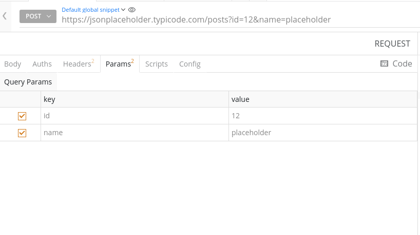

import { Link } from "gatsby";

## Overview

`Params` or query parameters are parameters that are specified after the question mark (`?`) in the form of key-value pairs in the URL.

For example, breaking down the URL (Uniform Resource Locator) https://jsonplaceholder.typicode.com/posts?id=12&name=vipulgupta2048

The protocol is **https**
The domain name is **jsonplaceholder.typicode.com**
The path to the resource (Path Parameter) is **/posts**
Finally, the query parameters being **id=12&name=vipulgupta2048**

Query Parameters are critical in sorting or filtering through resources for developers to find the right data. One can specify query parameters easily using the `Params` tab in the request panel of the API app.

Adding query parameters in the API app will result in them being added instantly to the URL present in the URL bar as parameters

## Additional Resources
- <Link to="apis/impressions/url-bar">URL Bar</Link>
- <Link to="apis/impressions/request-panel">Request Panel</Link>
