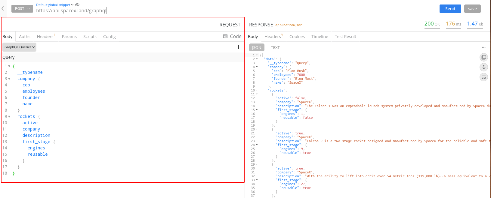
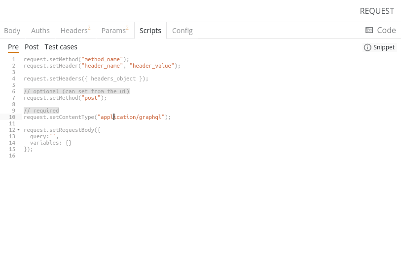
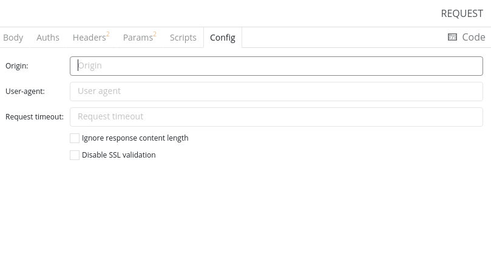
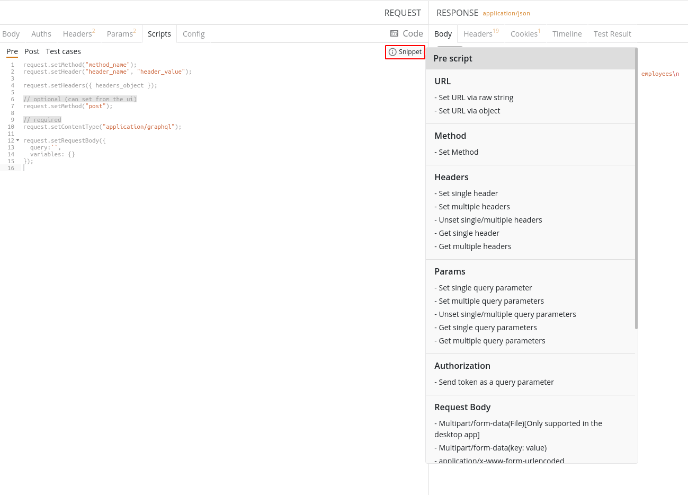

import { Link } from "gatsby";

## Overview

The request panel in the API app is the one-stop hub for configuring requests to the API endpoint. Whether you are debugging your API or integrating 3rd party APIs, you can easily get started with Firecamp.

Through the `Request Panel`, you can configure several parts of your request. These are as follows:

1. <Link to="request-body">**Body**</Link>
    - Quick method selection
    - Quick body type selection
    - Add multiple bodies
2. <Link="authentication">**Auths**</Link>
    - Quick auth type selection
3. <Link to="headers">**Headers**</Link> - The `Headers` tab helps to provide information about the body of the request. They represent the metadata associated with API requests and responses.
4. <Link to="./query-parameters">**Params**</Link> - Use the `Params` tab to specify query parameters in the form of key-value pairs in the URL.
5. **Scripts** - To help you debug right, `Scripts` in Firecamp support code snippets  provided by the user that can execute before or after the request is sent. Also, it helps with test cases.

6. **Config** - The `Config` tab helps you configure essential options for your API like `Origin` and `Timeout`.

7. **Code snippets Generator** - To help you implement, build and test faster, Firecamp lets you generate snippets of code in various languages and frameworks through the Code Snippets Generator.

When you send a request, Firecamp will show the response from the server in the <Link to="./request-panel">**Request Panel**</Link> with the functionality to view, format and copy the data received along with other information.
