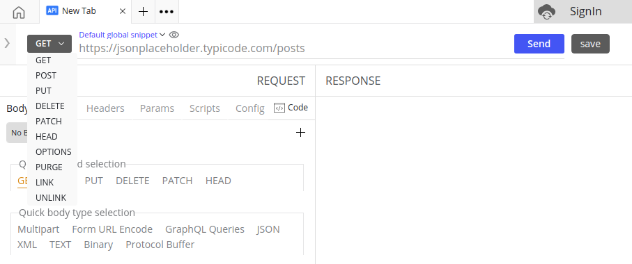

## Overview

The URL bar in the API app is the hub for sending, saving and modifying requests.

The URL bar consists of 5 elements:

1. Method selection
2. URL field
3. Send button (Execute)
4. Save button
5. Environment badges

## Method Selection
Request Methods are used by protocols like `HTTP` at the times of request to indicate the desired action that needs to be performed for a given resource. Firecamp supports several request methods that act on requests made to the API endpoint. The following methods are available for use through the dropdown in the URL bar:

- **GET** - The `GET` method is used to retrieve data and should have no other effect on the data.
- **POST** - The `POST` method is used to submit an entity to the specified resource, often causing a change in state or modify the data.
- **PATCH** - The `PATCH` method is used to apply partial modifications to a resource.
- **PUT** - The `PUT` method replaces all current representations of the target resource with the request payload.
- **DELETE** - The `DELETE` method deletes the specified resource.
- **HEAD** - The `HEAD` method asks for a response identical to that of a `GET` request, but without the response body.
- **OPTION** - The `OPTION` describes the communication options for the target resource.
- **PURGE** - The `PURGE` is used for removing cached files from the server, but can be used for removing anything related to caching.
- **LINK** - The `LINK` method adds meta-information (Object header information) to an object, without modifying the object's content.
- **UNLINK** - This `UNLINK` method deletes metainformation about an object. Only headers exactly matching the headers given are removed.

You can make a selection of your desired Request Method from the `Quick Method Selection` section availabe in the body tab of [**Request Panel**](./request-panel).

## URL Field
The API endpoint can be specified in the URL field. This is the endpoint on which the request will be made when the `Send` button is clicked.

_URL Bar with Request Method dropdown open_

An **API endpoint** is a unique URL where requests sent by one program are answered and data in form of objects or collections of objects are returned from where the resource lives (Databases). In Firecamp, the URL bar can be used to enter API endpoints with request methods attached to it. **API endpoints** facilitate the interaction of one system with another system that takes care of the processing and storage of data.

## Send Button (Execute)
The orange `Send` button in the URL bar execute/sends your request to the endpoint specified in the URL field with the parameters you configured.

<!--TODO: Add links to Environment Snippets &  Projects in Firecamp-->
## Save Button
The `Save` button in the URL bar saves your request to the project/module for future use by you or your team. Learn more about **Projects in Firecamp** and [**Steps to save your request in Firecamp**](../actions/saving-your-requests).

## Environment Badges
The `Default` and `Project` environment snippets (if working inside a project) can be accessed from the URL bar through the dropdown list. You can toggle between different environments or create new ones as per the usecase. Learn more about **Environment Snippets**.

## Additional Resources

- [API Endpoints](https://en.wikipedia.org/wiki/Web_API#Endpoints)
- [Request Methods](https://developer.mozilla.org/en-US/docs/Web/HTTP/Methods)
