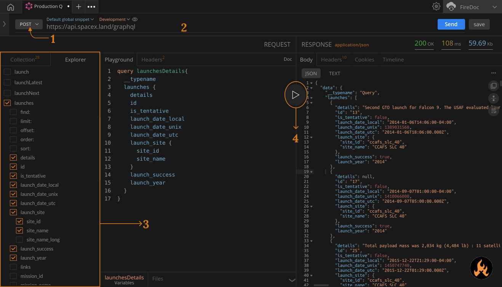

import Zoom from 'react-medium-image-zoom';

## Prerequisites

In order to follow along with this Action, you must have:
- Open GraphQL tab from Home. 

## Directions

To demonstrate this action we'll use the [SpaceX GraphQL API](https://spacex.land/) to test various operations. 
1. Select the request method `POST` from the drop-down menu and set the following API end-point `https://api.spacex.land/graphql` in URL bar.
2. Navigate to the `Explorer` tab and click on `fetch schema`. 
3. Click on the Schema objects and construct your query according to your requirement. For this example, we'll fetch data about **Launch Details**
As per you click on the schema objects, the query will automatically generate in the playground area.

You can use the following query

```graphql
query launchesDetails{
  __typename
  launches {
    details
    id
    is_tentative
    launch_date_local
    launch_date_unix
    launch_date_utc
    launch_site {
      site_id
      site_name
    }
    launch_success
    launch_year
  }
}
```

4. After writing the query, hit the play button. 


Pro Tip :
>You can create `Mutation` same as we wrote the `Query`

>Instead of manually writing the appropriate query syntax, use the tiny `Q`, `S`, and `M` buttons on the top right corner of the Request Panel to auto-complete the syntax for a Query, Subscription, and Mutation respectively.

> You can run multiple queries from the playground itself, just click - setfocus on the query area that you want to run and click on the Play button.

Note : 
> If you just want to use the sample GraphQL API, click on the `Sample` next to the `Request`.
Voila! Now you know how to send your first request.

<Zoom>
    
</Zoom>

## Additional resources

- Playground
- Explorer
- Query Collection
