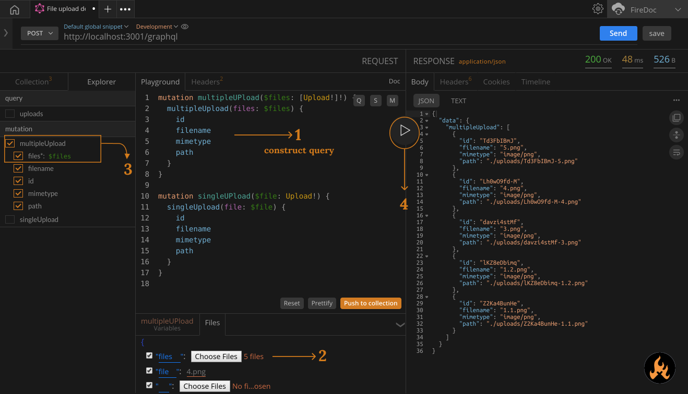

import Zoom from 'react-medium-image-zoom';


## Prerequisites

1. To elaborate this actions we're using the example of [GraphQL file Upload](https://github.com/jaydenseric/apollo-upload-examples)
2. You can clone and use this example too. 
3. Write server `URL` in the URL bar and follow the below steps. 


## Directions

1. Construct the `mutation` with the details you want to insert. For our example we'll write this mutation.

``` graphql
mutation multipleUPload($files: [Upload!]!) {
  multipleUpload(files: $files) {
    id
    filename
    mimetype
    path
  }
}
```
2. After writing your mutation, navigate to the `Files` area in the playground area. Upload the file of your choice with the `Choose files` option. Along with that, assign the 'Name' of the file variable that we'll pass in the mutation function argument. 
> Incase of multiple uploads, hold the `Ctrl` key while selecting files. 

3. In the `Explorer` tab, assign the variable `files*` with `$` and `Variable-name` that we've used while Uploading files. 

4. Hit the play button.
5. You'll receive the response.

<Zoom>
    
</Zoom>

## Additional resources
