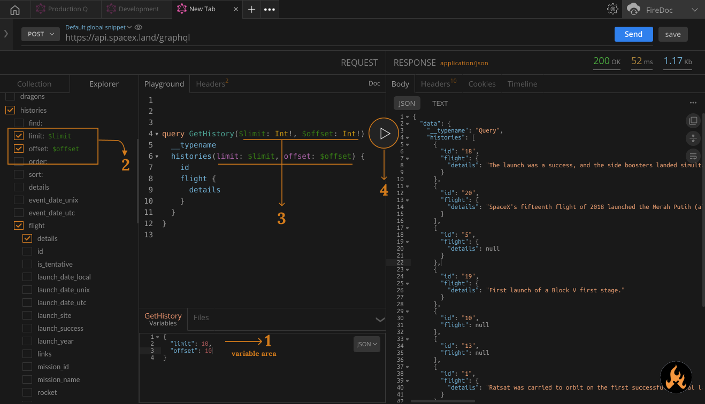

import Zoom from 'react-medium-image-zoom';

## Prerequisites

- configure GraphQL queries in which you want to pass the variable.

```graphql 
query GetHistory {
  __typename
  histories(limit: 10, offset: 10) {
    id
    flight {
      details
    }
  }
}
```

## Directions

1. After writing your query, navigate to the `Variables` area below the playground area. You can define the variable in `JSON`, `Form` and `Table` format.
You'll notice, `Query-name` with `Variable` that represent the current query variable. 
In our example, we have query-name `GetHistory`, pass below variable in query variable are,

```json
{
  "limit": 10,
  "offset": 10
}
```

2. Assign the same variable in `Explorer` tab with the `$` and `variable name`, ie. `$limit`
3. Now pass the function argument with `variable name` and `variable-type` as per below reference code, 

```graphql
query GetHistory($limit: Int!, $offset: Int!) {
  __typename
  histories(limit: $limit, offset: $offset) {
    id
    flight {
      details
    }
  }
}
```

4. Hit the play button.

You can now use any variable same as the above instructions.

<Zoom>
    
</Zoom>

## Additional resources
