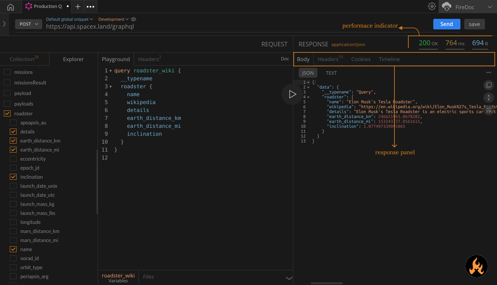

import Zoom from 'react-medium-image-zoom';

## Prerequisites

In order to follow along with this Action, make sure you refer to the following Actions first:

1. Configuring GraphQL end points
2. Using a sample
3. Sending your first request with GraphQL

## Directions
1. The `Performace` indicator shows the `response-code`, `response-time`, `response-size` , you can measure the Performace of your API from this information.
2. The `Body` tab in the Response Panel displays the results returned by the server in response to your request. In our case, it will return the Body payload that we sent through the `POST` API.
3. The `Headers` tab beside it shows the details about the response, like `content-type`, `cache-control`, `server name`, `date/time` of the response, etc.
4. Additionally, you can check for the cookies in the `Cookies` tab.
5. Another important tab is the `Timeline` tab that describes the timely information of the whole request lifecycle, from request originator to response completion. It is very useful to debug the request at a certain stage of the execution like SSL handshake, PROXY connected, etc.

<Zoom>
    
</Zoom>
## Additional resources
- Header
- Cookies
- Timeline
- Test result
