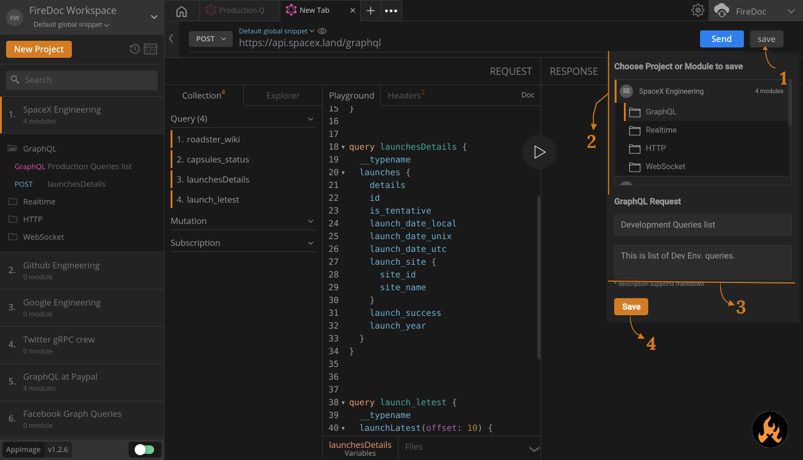

import Zoom from 'react-medium-image-zoom';

## Prerequisites

- configure GraphQL request and playground

## Directions

1. Once you're done with testing your first request, navigate, and click to the `Save` button beside the `Send` button.
2. Enter the `title` and `description` of the request.
3. Choose a `project` or a `module` you wish to save your request to.
4. Hit Save.

<Zoom>
    
</Zoom>
## Additional resources
