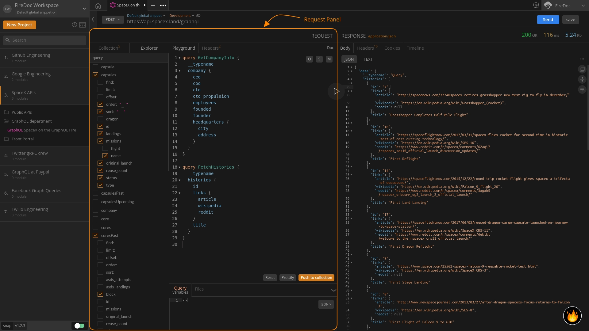

import Zoom from 'react-medium-image-zoom';
import 'react-medium-image-zoom/dist/styles.css';

## Overview

<Zoom>
    
</Zoom>

The `Request Panel` in the GraphQL app is the one-stop hub for crafting, configuring, and saving your queries, subscriptions and mutations.

Through the `Request Panel`, you can get access to several components available in the app. These are as follows:

1.  **Playground** -  The `Playground` enables you to work with GraphQL APIs to write queries, mutations & subscriptions and comes with out-of-the-box features like contextual and intuitive auto-completion, syntax-highlighting, and source-code prettifier.
2.  **Explorer** - The `Explorer` component located in the request panel helps you in building queries more flexibly in the `Playground` through a pre-populated schema.
3.  **Collection** - The `Collections` component in the request panel that lets you organise your queries that you have saved using the `Push to Collections` button in the `Playground`.
4.  **Headers** - The `Headers` tab helps to provide more information/metadata about the query.
5.  **Schema Documentation** - The `Schema Documentation` provides developers blazing fast access to GraphQL documentation from right inside the Firecamp app to better structure and troubleshoot their queries.

When you send a query to your GraphQL endpoint, Firecamp will show the response from the server in the `Response Panel` on the right with the functionality to view, and copy the data received from the server along with other information.
