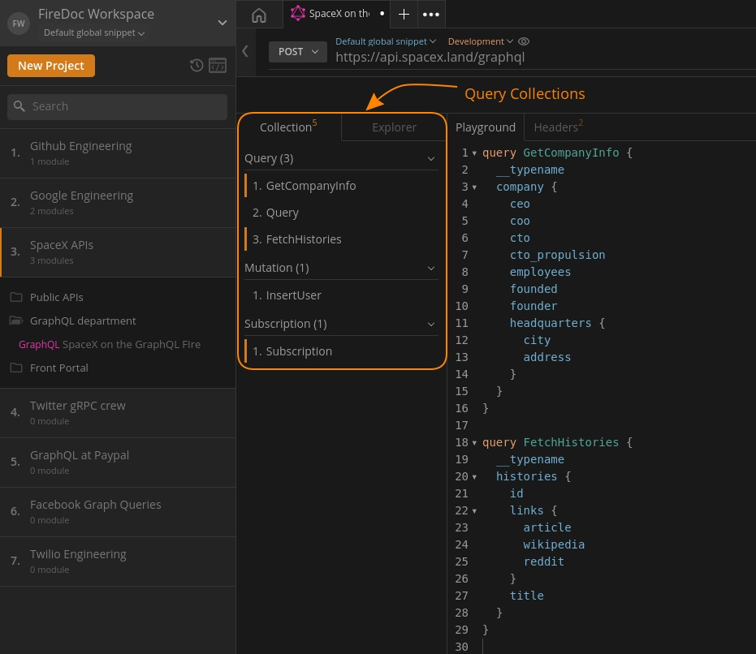

import Zoom from 'react-medium-image-zoom';
import 'react-medium-image-zoom/dist/styles.css';

## Overview

<Zoom>
    
</Zoom>

The `Collections` component in the request panel that lets you organise your queries that you have saved using the `Push to Collections` button in the `Playground`. Through Collections you can:

- Build from where you left off in the Firecamp app using the `Copy 📋` button
- Run the saved queries right from Collections using the `Play ▶️` button
- Organise your queries into 3 categories mainly, queries, mutations and subscriptions.

`Collections` is a library of your saved queries grouped into categories available to run and modify when needed. Use `Push to Collections` button to save all your queries present in the `Playground` into `Collections`. Later, navigate to the `Collections` tab to check them out.
