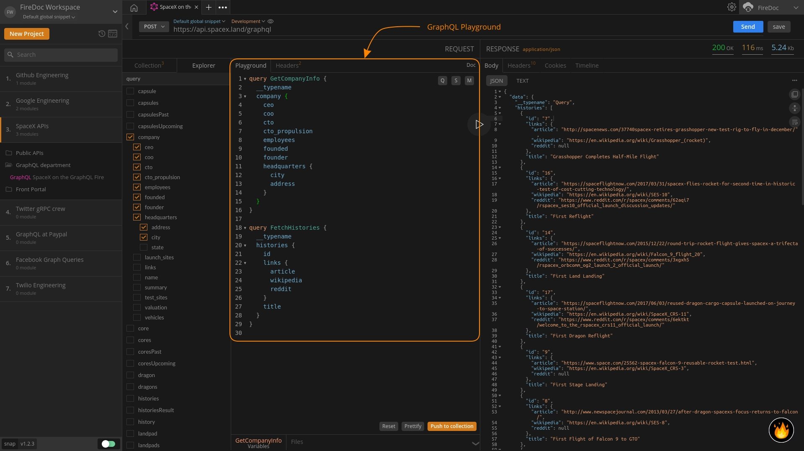

import Zoom from 'react-medium-image-zoom';
import 'react-medium-image-zoom/dist/styles.css';

## Overview

<Zoom>
    
</Zoom>

The `Playground` enables you to work with GraphQL APIs to write queries, mutations & subscriptions and comes with out-of-the-box features like contextual and intuitive auto-completion, syntax-highlighting, and source-code prettifier.

## Writing Multiple Queries/Mutations/Subscriptions

For maximum flexiblity, Firecamp allows you to write multiple types of GraphQL operations inside the `Playground`. Providing developers power to write multiple queries, mutations and subscriptions in one go for faster debugging and better response. Focusing on a specific query with your typing cursor in the `Playground`, will lead to it becoming the **active query** in the GraphQL app. All variables defined and media attached will be associated with that query only.

To prettify your queries, resetting your `Playground` or pushing (saving) the requests to `Collections`, you can use the options accessible in the `Playground` only. Just focus or hover the mouse in the playground section and the `Reset`, `Prettify` and `Push to Collection` buttons will become available for use.

## Using Quick Builder Templates

To get started faster with building your queries, mutations or subscriptions, use the `Q`, `M`, `S` buttons available in the `Playground` to start work with a template.

## Passing Arguments in your queries through variables

The panel below playground is the **`Variable Window`** which lets you pass arguments in your requests through variables. Through that you can add variables in the form of JSON, Form or table.

**For example**: `GetSingleHistory` is GraphQL query where we are passing an `id` parameter to get the details of a specific user.

```
query GetSingleHistory($id: ID!) {
    __typename
    history(id: $id) {
    id
    details
    }
}
```

Here, value for `id` can be filled using the `Variables Window` below the `Playground` for easier debugging and testing.

```
{
    "id": "1"
}
```

If you have more than one query in your `Playground`, then don't forget to make the query **active** and then add variables for it. To make a query active, click on the query in the playground and check to see if the name change below in the `Variable Window`.

## Debugging GraphQL Requests containing Media

Often at times, developers have to debug mutations where pictures or other media is involved. Firecamp has made the process a whole lot simpler to test with the `Files Window`.

> Placeholder for files window below the playground with a file attached and argument name. There should also be a mutation that is using that media file

To test your requests, upload the required media through the `Files Window` and add a variable to refer it with in your requests.


## Additional Resources
-
-
