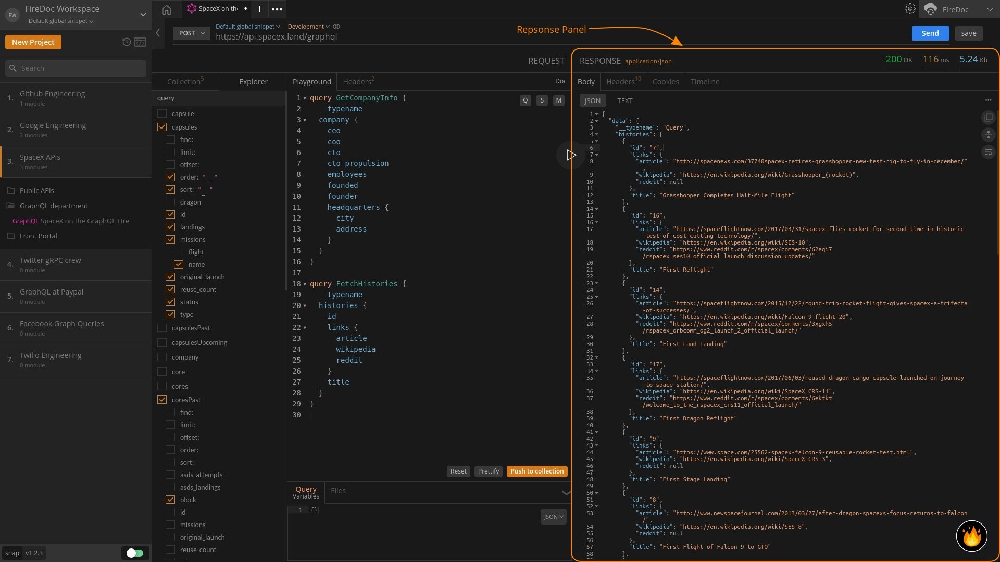
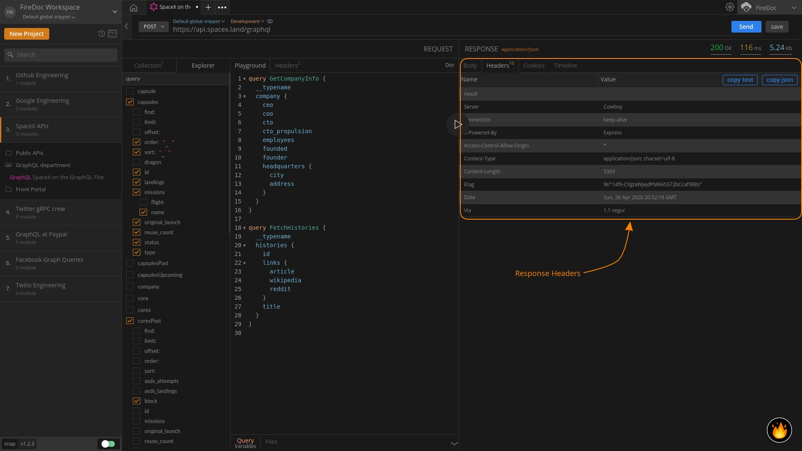
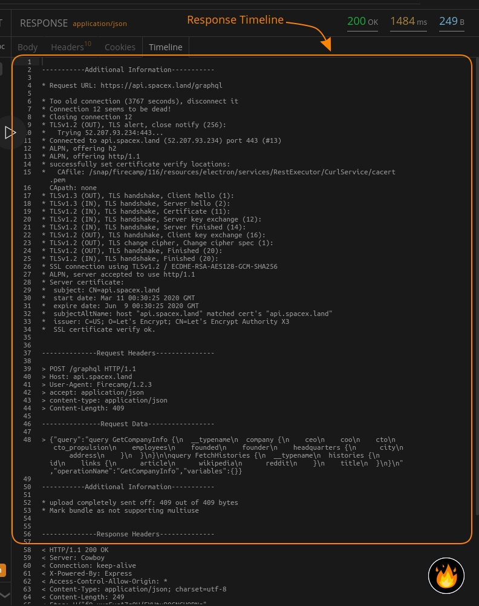
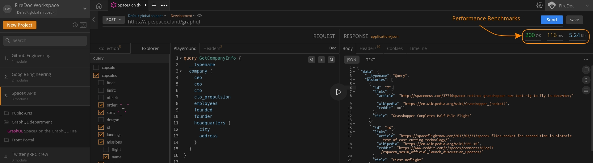

import Zoom from 'react-medium-image-zoom';
import 'react-medium-image-zoom/dist/styles.css';

## Overview

The response panel in the Firecamp GraphQL app is to view the information/data received as part of the response by the server when the query is executed by the user.

The panel provides a clear eagle-eye view of your response body as well as features to dive deeper into headers, cookies, timeline and performance benchmarks associated with your request.

<Zoom>
    
</Zoom>

The Response body can be viewed in the form of JSON. Options like copy, fold and word wrap are also available through the utility icons. That way the GraphQL response body can be viewed, and styled as needed.

The response headers, cookies, and timelines for the response can be viewed by toggling through tabs. The `copy json` and `copy text` can be used to copy information in any format that is required.

## Headers

<Zoom>
    
</Zoom>

Response Headers are essentially metadata of the response. Here's how the response headers are represented under the `Headers` tab in Firecamp GraphQL app.

``` JSON
{
  "Access-Control-Allow-Origin": "*",
  "Connection": "keep-alive",
  "Content-Length": "247",
  "Content-Type": "application/json; charset=utf-8",
  "Date": "Tue, 07 Apr 2020 12:10:45 GMT",
  "Etag": "W/\"f7-ypZevHC0qOm8GWCOL00li3xfNes\"",
  "Server": "Cowboy",
  "Via": "1.1 vegur",
  "X-Powered-By": "Express"
}
```

## Cookies

`Cookies` are used for session management. Information regarding cookies can be accessed through the `Cookies` tab in the response panel.

## Timeline

`Timeline` tab in Firecamp helps developers get an overview on their queries made. Timeline provides session information, request and response headers, size of response data received, and additional information if any. This goes to be a great tool to debug response of your GraphQL's as it provides all information in a raw and compiled form.

<Zoom>
    
</Zoom>

## Performance Benchmarks

<Zoom>
    
</Zoom>

The performance benchmarks listed on the response panel helps the user know more about GraphQL's performance traits. The first number being the status code returned, next being the response time of the GraphQL listed in milliseconds and last being the data transferred in kilobytes.

GraphQL app in Firecamp returns an appropriate status code so that the user can know the actual issue and process accordingly.

```
1. 1XX Codes: Informational Codes
2. 2XX Codes: Success Codes
3. 3XX Codes: URL Redirection
4. 4XX Codes: Error Codes
5. 5XX Codes: Server error
```
