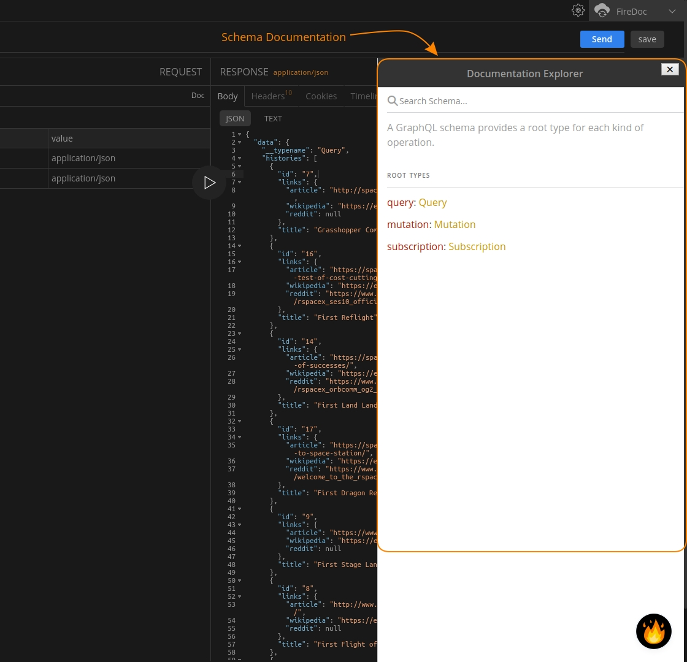

import Zoom from 'react-medium-image-zoom';
import 'react-medium-image-zoom/dist/styles.css';

## Overview

<Zoom>
    
</Zoom>

The `Schema Documentation` provides developers blazing fast access to GraphQL documentation from right inside the Firecamp app to better structure and troubleshoot their queries. This is documentation custom generated in regards to your endpoint providing more information about the query schema and operations that can be performed.

Click `Doc` link present in the `Playground` to open the Documentation Explorer to view the documentation and find more information about query, mutation and subscriptions operations that can be made on the endpoint.
