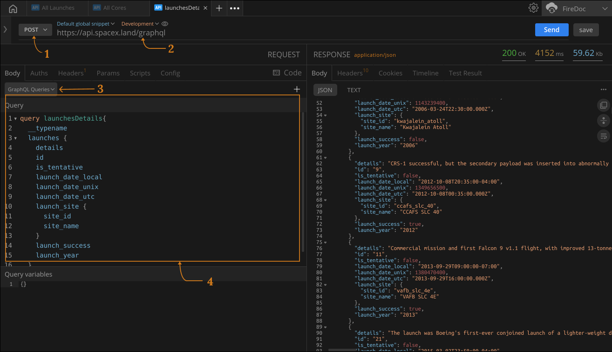

import Zoom from 'react-medium-image-zoom';


## Prerequisites

-  Adequate prior knowledge of GraphQL end-points and Queries.

## Directions

1. Select the POST method from the Method drop-down list.
2. Set this SpaceX GraphQL API end-point `https://api.spacex.land/graphql` in the `URLbar` input.
3. Select the `GraphQL queries` item the Quick Body Type Selection section.
4. Input a below query payload inside the Request Panel.
```graphql
query launchesDetails{
  __typename
  launches {
    details
    id
    is_tentative
    launch_date_local
    launch_date_unix
    launch_date_utc
    launch_site {
      site_id
      site_name
    }
    launch_success
    launch_year
  }
}
```
5. Hit enter and wait for query response from server. 

<Zoom>
    
</Zoom>

This process is similar to that of sending an API request to the server, except the payload is a GraphQL query.

## Additional information:
To test out GraphQL `variable`,
1. You can define your query variables in the `Query Variable` space below the `Query` space. 

<!-- ## Additional resources -->
