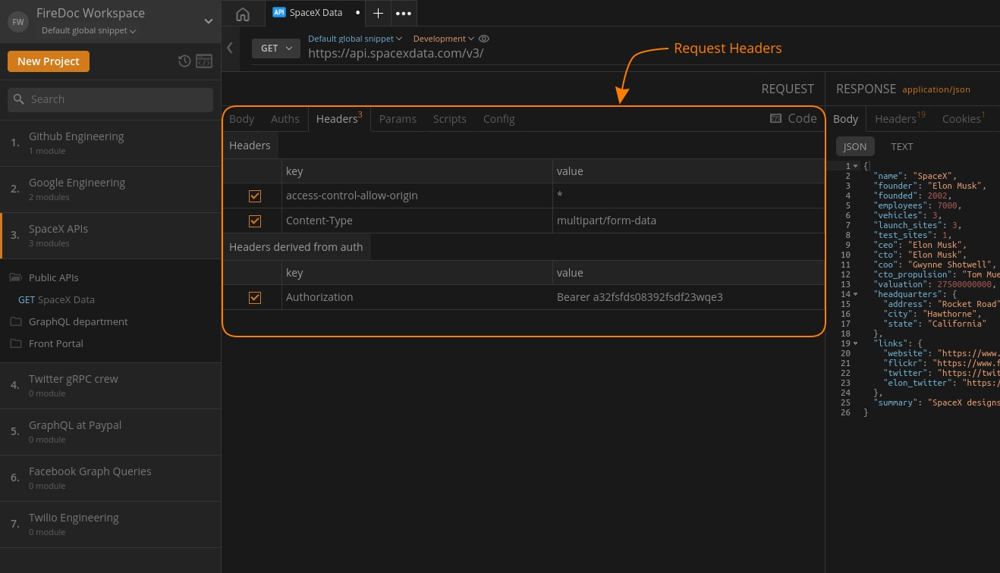

import { Link } from "gatsby";
import Zoom from 'react-medium-image-zoom';
import 'react-medium-image-zoom/dist/styles.css';

## Overview

<Zoom>
    
</Zoom>

Request headers are typically used for authentication and to provide information about the body of the request. They represent the metadata associated with API requests and responses.

The `Headers` pass information regarding authentication, specify body type and track issues. These can be needed for:

- Request and Response Body
- Request Authorization
- Response Caching
- Response Cookies
- HTTP connection types and more

Firecamp allows you to create and configure headers from the `Headers` tab available in the request panel of the API app. Where headers can either be added in key-value pairs or by using variables through environment snippets.

Some popular headers are mentioned below:

- **Authorization**: Carries credentials or UUID keys containing the authentication information of the client for the resource being requested.

- **Content-Type**: Indicates media type (text/html or text/JSON etc.) of the response sent to the client by the server. This will help the client in processing the response body correctly.

- **Accept-Charset**: Indicates character sets acceptable by the client to the server.

- **Cache-Control**: Indicates cache policy defined by the server, a cached response can be stored by the client and re-used till the time defined by the Cache-Control header.

## Additional Resources
- <Link to="/discover%20firecamp/environment%20snippets/environment-snippets">Environment Snippets</Link>
