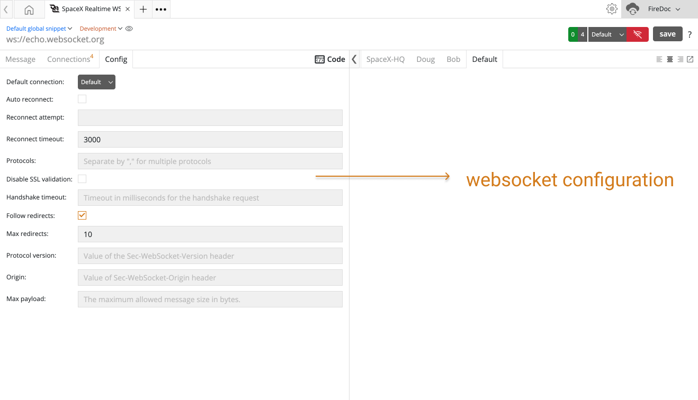

import Zoom from 'react-medium-image-zoom';
import 'react-medium-image-zoom/dist/styles.css';

## Overflow
Here in **Config Tab** in WebSocket client, you can find multiple options to configure WS connection. Following is the list of options with a specific purpose.

## Options
Here are options which can be used to configure WS connection.

|#| Options | Description |
| --- | ---| --- |
| 1. | `protocols`   <small>Desktop Only</small>  | Indicates sub-protocols, so that a single server can implement multiple WebSocket sub-protocols (for example, you might want one server to be able to handle different types of interactions depending on the specified protocol).   [More from reference][1] |
| 2. | `auto_reconnect` |  The client should reconnect or not after the connection closed/break.|
| 3. | `reconnect_attempt` | Defines how many times reconnect operation performed after connection closed/break. |
| 4. | `reconnect_timeout` | Defines the interval between each reconnects attempt. |
| 5. | `default_connection` | Defines the connection, which is selected as a default. |
| 6. | `disable_ssl_validation`   <small>Desktop Only</small> | Disable SSL validation. (Allow to connect with the secure server without a certificate, if set to true.) |
| 7. | `handshake_timeout`   <small>Desktop Only</small> | Timeout in milliseconds for the handshake request. This is reset after every redirection.   [Know more from reference][8]|
| 8. | `follow_redirects`   <small>Desktop Only</small> | Whether or not to follow redirects.   [More from reference][7]|
| 9. | `max_redirects`   <small>Desktop Only</small> | The maximum number of redirects allowed.   [Know more from reference][9]|
| 10. | `protocol_version`   <small>Desktop Only</small> | Value of the `Sec-WebSocket-Version` header.   The WebSocket protocol version the client wishes to use when communicating with the server. This number should be the most recent version possible listed in the [IANA WebSocket Version Number Registry][10]. The most recent final version of the WebSocket protocol is version 13.  [More from reference][10.1]|
| 11. | `origin`   <small>Desktop Only</small> | The `Origin` request header indicates where a fetch originates from. It doesn't include any path information, but only the server name. |
| 12. | `max_payload`   <small>Desktop Only</small> | The maximum allowed message size in bytes.   [Know more from reference][12]|

<Zoom>
    
</Zoom>

[1]: https://developer.mozilla.org/en-US/docs/Web/HTTP/Protocol_upgrade_mechanism
[7]: https://github.com/websockets/ws/blob/HEAD/doc/ws.md#new-websocketaddress-protocols-options
[8]: https://github.com/websockets/ws/blob/HEAD/doc/ws.md#new-websocketaddress-protocols-options
[9]: https://github.com/websockets/ws/blob/HEAD/doc/ws.md#new-websocketaddress-protocols-options
[10]: https://www.iana.org/assignments/websocket/websocket.xml#version-number
[10.1]: https://developer.mozilla.org/en-US/docs/Web/HTTP/Protocol_upgrade_mechanism
[12]: https://github.com/websockets/ws/blob/HEAD/doc/ws.md#new-websocketaddress-protocols-options