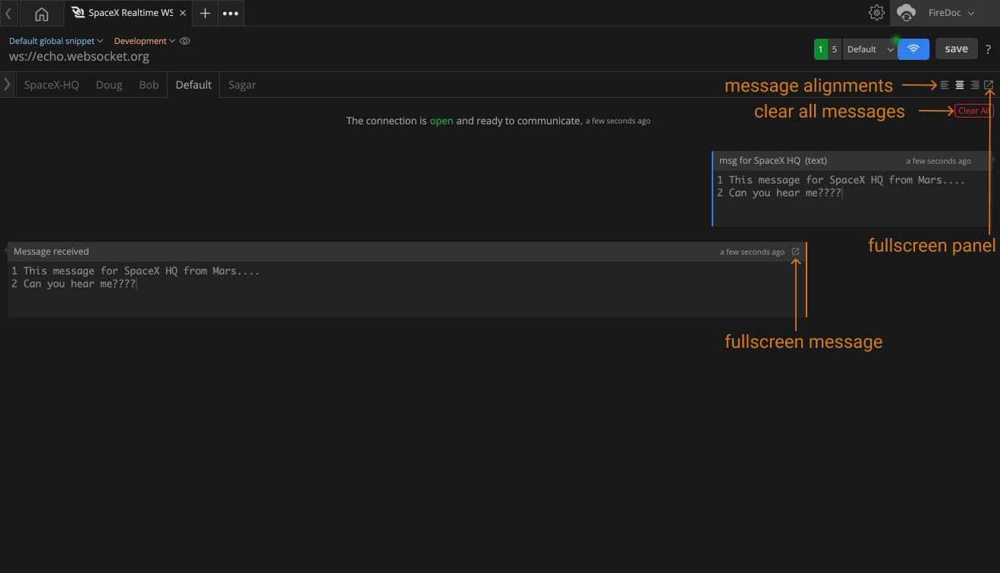

import Zoom from 'react-medium-image-zoom';
import 'react-medium-image-zoom/dist/styles.css';

## Overview
Also known as **Response Panel** or **Messages Panel**, placed at right side pane in WebSocket client. This panel will show all the messages sent from the Firecamp's WS client and received from the WS server in a very intuitive chat-board like debugging UI.

## Debug/Monitor multiple WS connections
This **response-panel** will arrange an individual tab for each connection. You can switch to the connection tab to review the WS messages which are being sent and received.

## Features
This feature-rich chat-board like **Response-Panel** has many small control-buttons that hold specific actions within itself.

| # | Feature | Description |
| --- | --- | --- |
| 1. | Fullscreen panel | View the whole panel in full-screen to be more focused. |
| 2. | Fullscreen message | View the **long message** in full-screen to read long text. |
| 3. | Message Alignments | Align message list to `right`, `left` of `center` |
| 4. | Clear all messages | Clear all messages from current connections |

<Zoom>
    
</Zoom>
