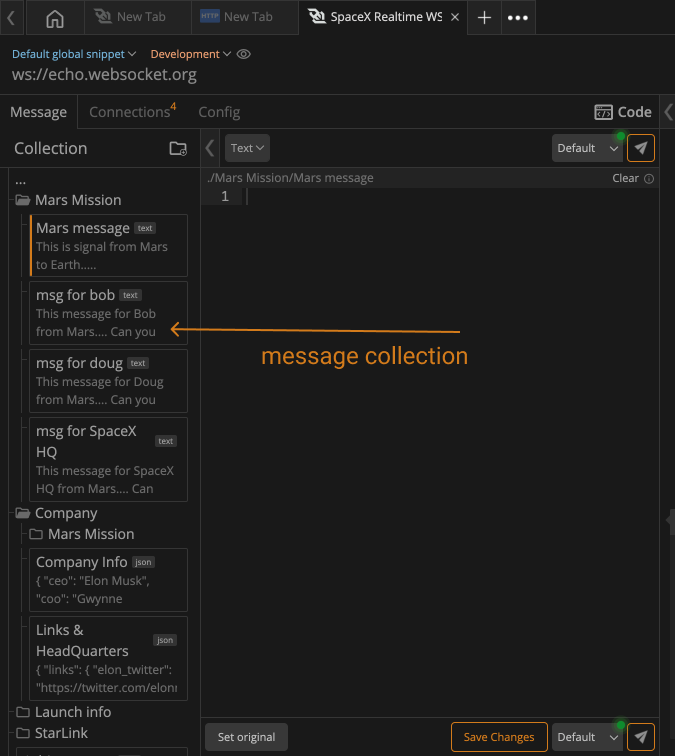

import Zoom from 'react-medium-image-zoom';
import 'react-medium-image-zoom/dist/styles.css';
import YouTube from 'react-youtube';

## Overview
It's a collection of messages which can be used any time in the future and always be synced within the team collaboratively. You can save messages at the root level or in folders at the nth level. It is quickly accessible with previously saved messages at the time of testing and documenting.

Learn more about [ How to prepare a Message Collection?][1]

<Zoom>
    
</Zoom>

>Check out the below video to learn how you can create a message collection that you can use in the future again with the single click. 

<YouTube videoId="bjLeA99lwxg" />

[1]: /websocket/a/preparing-message-collection/